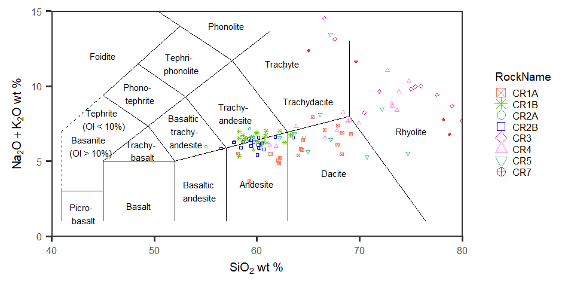

Costa Rica Glass
================
Julie M. Coulombe
2/25/2020

Create a new column to sort by bulk rocks into a column for Rockname

Use the below chunk to filter for analysis constraints

``` r
rock_data[rock_data == ""] <- NA

rock_data_wt <- rock_data %>%
  select("RockName":"Total", "MgN") %>%  #choose relevant columns
  filter(Total > 95.0 & Total < 101.0) %>% #select rows based on Total
  filter(is.na(V2O3) & SiO2 < 90.0 & Al2O3 < 22.0 & Al2O3 > 10 & K2O > 1.0) #select rows based on elements
```

Create plot for SiO2 vs Na2O + K2O by each rock
<!-- -->

Create plot for SiO2 vs Mg\# by each rock
<!-- -->

Create plot for SiO2 vs FeO by each rock
<!-- -->

Create plot for Al2O3 vs TiO by each rock
<!-- -->

Create a TAS Diagram as a background layer

<!-- -->

Plot Alkali by Rock Name
<!-- -->

Overlay Alkali Plot on TAS Diagram

    ## Warning: Removed 1 rows containing missing values (geom_point).

<!-- -->

Now to look at plots of all rocks together

Plot Silica vs Mg\# by rock
<!-- -->

Plot Silica vs Iron by rock
<!-- -->

Plot Aluminum vs Titanium by rock
<!-- -->
